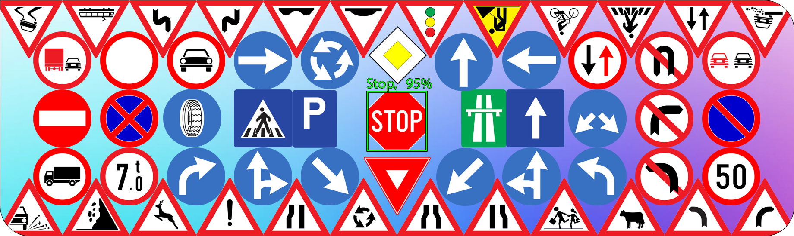
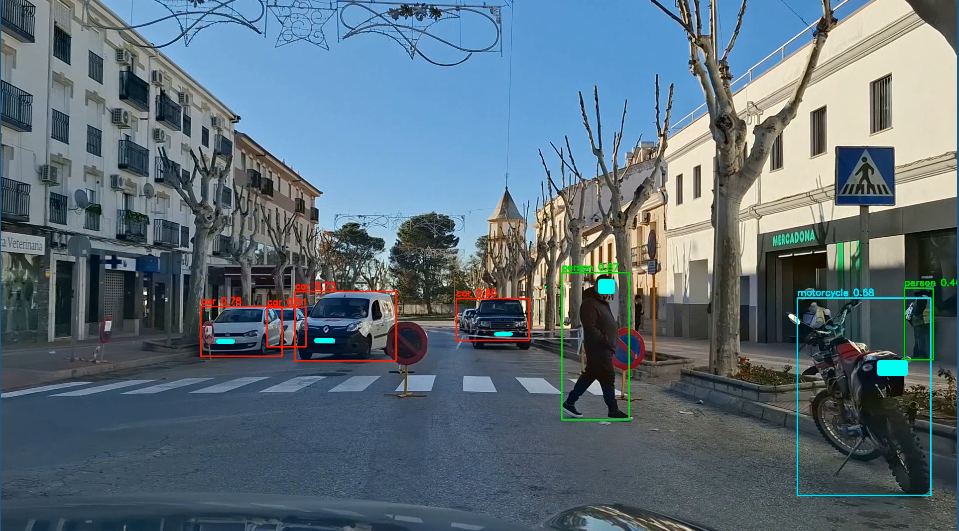
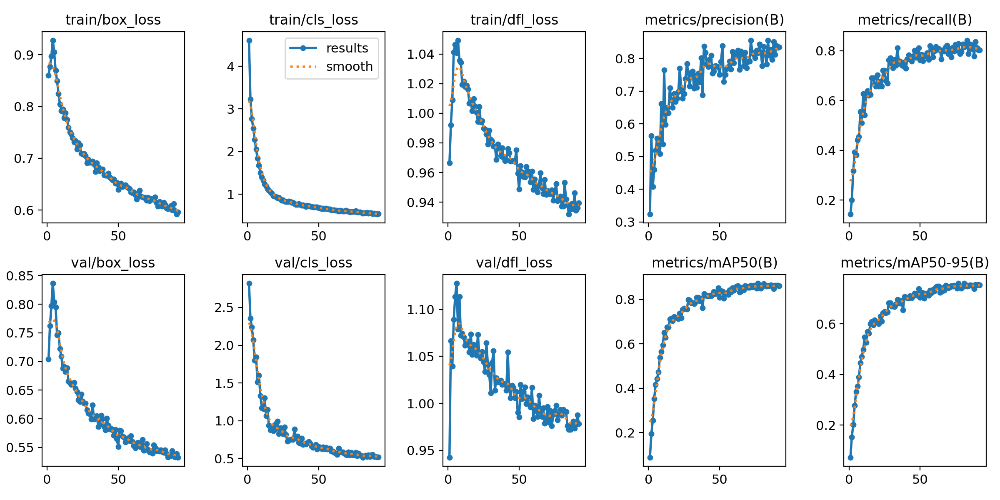
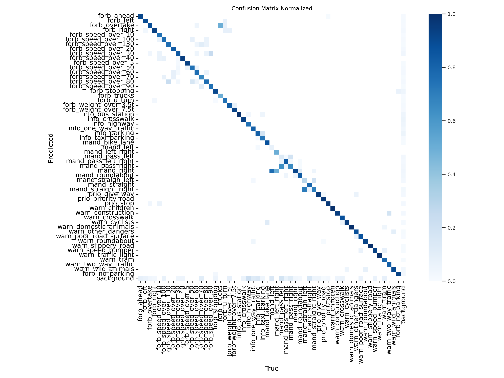
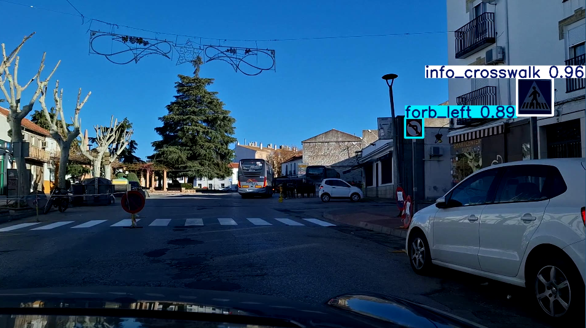
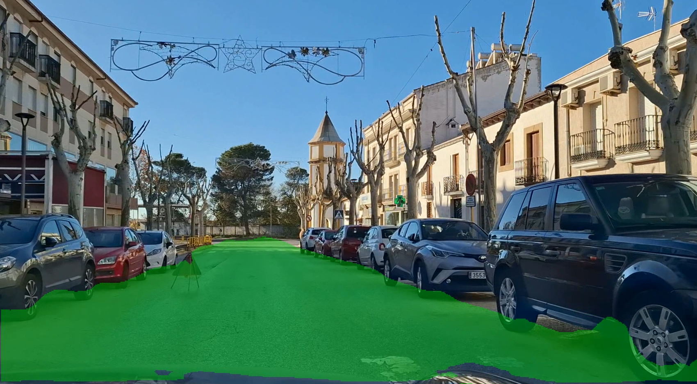

# Trabajo de curso VC

## Intorducción
En la actualidad, la seguridad vial se ha convertido en un aspecto prioritario 
para gobiernos, empresas y la sociedad en general. El aumento en el número de 
vehículos en circulación, el crecimiento urbano y la complejidad de las 
infraestructuras de transporte hacen que sea cada vez más necesario 
desarrollar soluciones tecnológicas que faciliten la toma de decisiones y la 
prevención de accidentes. En este contexto, la visión por computador ofrece 
herramientas avanzadas para la detección y el análisis de elementos en 
entornos de tráfico, proporcionando información en tiempo real para la 
mejora de la seguridad y la optimización de la movilidad.

Este trabajo propone el uso de la arquitectura YOLO (You Only Look Once) 
para la detección de componentes clave en escenarios de tráfico (personas, 
vehículos y señales), complementando dicha detección con la segmentación de 
la vía para un mayor entendimiento del entorno vial. El objetivo principal es 
diseñar un sistema capaz de procesar y analizar de forma eficiente las 
imágenes de tráfico, ofreciendo resultados de notoria precisión para futuras 
aplicaciones como sistemas de asistencia a la conducción autónoma, monitoreo 
del tránsito o identificación de situaciones de riesgo. Mediante esta 
propuesta, se busca contribuir al desarrollo de soluciones más seguras, 
robustas y eficientes para la gestión del tráfico y la protección de todos 
los usuarios de la vía.

## Datasets

### Señales de tráfico
El dataset empleado en este proyecto proviene del siguiente [cojunto de datos](https://universe.roboflow.com/radu-oprea-r4xnm/traffic-signs-detection-europe) proveniente de roboflow.

Dispone de un total de 4381 imagenes de las cuales 3253 corresponden al cojunto de entrenamiento y 1128 al conjunto de validación.

| Dataset Split | Porcentaje | Imágenes |
|---------------|------------|----------|
| **Train Set** | 74%        | 3253     |
| **Valid Set** | 26%        | 1128     |
| **Test Set**  | 0%         | 0        |

Las imagenes están repartidas en un total de 55 clases de señales europeas:

[Source](https://universe.roboflow.com/radu-oprea-r4xnm/traffic-signs-detection-europe)

| Index | Name                       | Index | Name                       |
|-------|----------------------------|-------|----------------------------|
| 0     | forb_ahead                | 28    | mand_left                 |
| 1     | forb_left                 | 29    | mand_left_right           |
| 2     | forb_overtake             | 30    | mand_pass_left            |
| 3     | forb_right                | 31    | mand_pass_left_right      |
| 4     | forb_speed_over_10        | 32    | mand_pass_right           |
| 5     | forb_speed_over_100       | 33    | mand_right                |
| 6     | forb_speed_over_130       | 34    | mand_roundabout           |
| 7     | forb_speed_over_20        | 35    | mand_straigh_left         |
| 8     | forb_speed_over_30        | 36    | mand_straight             |
| 9     | forb_speed_over_40        | 37    | mand_straight_right       |
| 10    | forb_speed_over_5         | 38    | prio_give_way             |
| 11    | forb_speed_over_50        | 39    | prio_priority_road        |
| 12    | forb_speed_over_60        | 40    | prio_stop                 |
| 13    | forb_speed_over_70        | 41    | warn_children             |
| 14    | forb_speed_over_80        | 42    | warn_construction         |
| 15    | forb_speed_over_90        | 43    | warn_crosswalk            |
| 16    | forb_stopping             | 44    | warn_cyclists             |
| 17    | forb_trucks               | 45    | warn_domestic_animals     |
| 18    | forb_u_turn               | 46    | warn_other_dangers        |
| 19    | forb_weight_over_3.5t     | 47    | warn_poor_road_surface    |
| 20    | forb_weight_over_7.5t     | 48    | warn_roundabout           |
| 21    | info_bus_station          | 49    | warn_slippery_road        |
| 22    | info_crosswalk            | 50    | warn_speed_bumper         |
| 23    | info_highway              | 51    | warn_traffic_light        |
| 24    | info_one_way_traffic      | 52    | warn_tram                 |
| 25    | info_parking              | 53    | warn_two_way_traffic      |
| 26    | info_taxi_parking         | 54    | warn_wild_animals         |
| 27    | mand_bike_lane            |


A este dataset se el ha ampliado una clase más, correspondiente a las señales de prohibido aparcar:
| Índice | Nombre de la Clase              |
|--------|---------------------------------|
| 55      | forb_no_parking                |

Esta clase es entrenada haciendo uso de varias imagenes obtenidas de otro [conjunto de señales](https://universe.roboflow.com/ula-demir/parkyasak) proveniente de robloflow.


### Segementación de carreteras
Para poder entrenar un modelo que segmente la carretera se hará uso de un dtaset con variedad de carreteras segmanetadas.
El dataset se buede obtener en el siguiente [enlace](https://universe.roboflow.com/ditnov202/road_esgmentation/).

## Modulos

### Detección de objetos comunes en la calle

Para la detección de objetos comunes en la calle como pueden ser los vehiculos y personas se aprovecha el modelo preentrenado de yolo11 el cual ya incorpora muchas de las clases que pueden ser relevantes en la calle. En este proyecto en concreto se usará las siguientes clases:

```py
ALLOWED_CLASSES = {
    0: 'person', 
    1: 'bicycle', 
    2: 'car', 
    3: 'motorcycle', 
    5: 'bus', 
    6: 'train', 
    7: 'truck', 
    8: 'boat', 
    9: 'traffic light', 
    11: 'stop sign', 
    12: 'parking meter', 
    15: 'cat', 
    16: 'dog', 
    17: 'horse',
    19: 'cow', 
    21: 'bear'
}
```



### Detección de señales

Para el módulo de detección de señales, se implement el modelo YOLOv11n con el propósito de optimizar la relación entre precisión y velocidad de cómputo. Este balance es crucial en sistemas embebidos para vehículos, donde los recursos son limitados y la capacidad de procesamiento en tiempo real es un factor determinante. A continuación, se puede observar cada métrica obtenida durante el entrenamiento y validación del modelo:



Durante el entrenamiento y validación, las métricas de pérdida, como box_loss, cls_loss, y dfl_loss, disminuyeron consistentemente, indicando una mejora en la localización y clasificación de señales.

La precisión (precision(B)) alcanzó valores cercanos al 0.8, mostrando confiabilidad en las predicciones, mientras que el recall (recall(B)) aumentó, demostrando una detección efectiva de señales reales. La evaluación mediante la métrica mAP confirmó el buen desempeño del modelo, con un mAP50(B) superior a 0.8 y una tendencia positiva en mAP50-95(B), reflejando detecciones precisas en diferentes niveles de superposición.



La matriz de confusión normalizada muestra el desempeño del modelo YOLOv11n en la clasificación de señales, con las clases reales en el eje horizontal y las predicciones en el vertical. La concentración de valores en la diagonal principal refleja que el modelo clasifica correctamente la mayoría de las señales, mientras que los valores fuera de esta diagonal indican confusiones entre clases.



### Segmentación de la carretera
Para la segmentación de carreteras se hace uso de la versión de YOLO11n con capacidad de segmentación. A este modelo se le realiza un entrenamiento para que identifique y delimite (segmentar) la calzada con el dataset mencionado anteriormente con carreteras segmentadas.



## Desenlace
---

## Conclusiones y propuestas de ampliación

## Autor
Marcos Miguel Sáchez Antonio